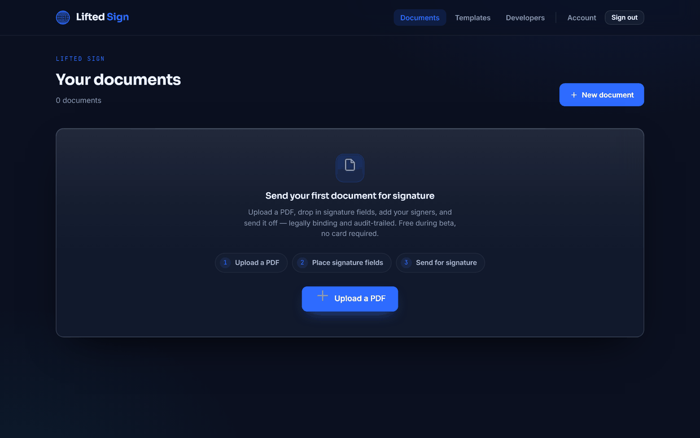

<div align="center">

# Lifted Sign

**Legally-binding e-signatures you host yourself — a self-hostable DocuSign alternative that runs on nothing but SQLite.**

[](./LICENSE)
[](./CHANGELOG.md)
[](./CONTRIBUTING.md)
[](https://www.python.org/)
[](#tests)

<br />


</div>

Upload a PDF, place fields, add signers, and send single-use signing links. Every
completed document is cryptographically sealed and ships with a **Certificate of
Completion** — the audit trail of signer identities, timestamps, IP addresses, and
consent records that ESIGN and UETA call for. Run it on your own hardware in one command,
or let us host it.

<div align="center">

</div>

<div align="center">

</div>

## What makes it different

Plenty of tools send e-signatures. Lifted Sign is the one you can **own**:

- **🏠 Self-hostable, for real.** Your documents, signers, and audit trail live on *your*
  infrastructure — not a vendor's cloud. Data residency and air-gapped deploys are the
  default, not an enterprise upsell.
- **🪶 SQLite by default — no database to run.** It boots with zero external services.
  One secret, and you're signing. Point it at Postgres with a single env var when you
  outgrow a file.
- **🔏 Real PAdES certification — not a flattened image.** Completed PDFs get a
  PKCS#7/PAdES digital signature that any PDF reader can verify and that breaks visibly
  if the file is altered. (No cert yet? It falls back to a tamper-evident AES-integrity
  seal, so you're never unsealed.)
- **⚙️ Developer-first.** A clean REST API, an OpenAPI spec, and vendored
  **Python + Node SDKs** — integrations are a copy-paste away, not a sales call.
- **🔓 AGPL-3.0, free forever when self-hosted.** No seat limits, no volume policing, no
  "contact us." The license is the only agreement.

See the [full comparison vs DocuSign, Dropbox Sign, and Documenso →](./docs/comparison.md)

## How it works

1. **Upload & prepare.** Drop in a PDF, place signature/date/text fields by anchor, and
   add one or more signers.
2. **Send.** Each signer gets a single-use link. They review, consent (ESIGN/UETA gate),
   and sign in the browser — no account required.
3. **Seal.** Once everyone signs, the PDF is sealed with a PAdES certification signature
   and a Certificate of Completion. Download both, or pull them via the API.

## Quickstart

**One command — pull the published image and go:**

```bash
docker run --rm -e SIGN_SECRET=$(openssl rand -base64 48) -p 8080:8080 ghcr.io/liftedholdings/lifted-sign
```

Then open **http://localhost:8080**. The image is built and published to GHCR by CI on
every push to `main` (as `:latest`) and on each tagged release.

> First run after the initial CI publish: the GHCR package must be set **Public** in the
> repository's package settings for anonymous `docker pull` to work — see
> [docs/self-hosting.md](./docs/self-hosting.md#running-from-the-published-image).

**Or build from source:**

```bash
git clone https://github.com/LiftedHoldings/lifted-sign.git
cd lifted-sign
cp .env.example .env

# Generate a real SIGN_SECRET and put it in .env (the server refuses to boot without one):
python -c "import secrets; print('SIGN_SECRET=' + secrets.token_urlsafe(48))"

# Run it — either with Docker:
docker compose up

# …or straight from Python:
pip install -e .
python -m sign
```

Then open **http://localhost:8080**.

> `SIGN_SECRET` is the one required setting. All login sessions, signer-access cookies,
> and one-time codes are keyed off it, so the server fails closed and loud if it is
> missing, too short, or a placeholder.

## Features

- **ESIGN/UETA compliance** — explicit consent gate, and a Certificate of Completion
  capturing identities, timestamps, IPs, and consent for every envelope.
- **PAdES/PKCS#7 sealing** with a tamper-evident AES-integrity fallback.
- **Anchor-based field placement** — signature, initials, date, text, and checkbox fields.
- **Single-use signer links** — no account required for signers.
- **Flexible sign-in** — passwordless email magic-link out of the box; Google SSO and
  phone OTP optional.
- **SQLite or Postgres**, console or SMTP email — switch by env var.
- **REST API + OpenAPI spec + Python/Node SDKs.**
- **Reminders, voiding, and re-download** of sealed PDFs and certificates.

## Configuration

Every setting is read from the environment (a `.env` file, real env vars, or your
orchestrator's secret store). Copy [`.env.example`](./.env.example) to `.env` and fill
in what you need — it documents each variable, its default, and when you actually need
it. SQLite, console email, and passwordless email **magic-link** sign-in all work with
nothing but `SIGN_SECRET` set; SMTP, Postgres, Google/phone sign-in, and PAdES
certificates are optional add-ons you switch on as you grow.

## Self-hosting

See [**docs/self-hosting.md**](./docs/self-hosting.md) for the full environment
reference, SMTP setup, switching to Postgres, installing a PAdES signing certificate,
and running Lifted Sign behind nginx with TLS.

For a tour of how Lifted Sign is built — the ESIGN/UETA compliance model, the
three-runtime design, and the security and persistence layers — see
[**docs/ARCHITECTURE.md**](./docs/ARCHITECTURE.md).

## Developer API

Lifted Sign exposes a REST API under `/api/mysign/*` for creating envelopes, adding
signers, placing fields, sending, reminding, voiding, and downloading sealed PDFs and
certificates. The in-app **`/developers`** page documents the endpoints and serves an
OpenAPI spec.

Ready-to-use, dependency-free clients are vendored under [`sdks/`](./sdks):

- [`sdks/lifted_sign.py`](./sdks/lifted_sign.py) — Python 3.8+, standard library only.
- [`sdks/lifted-sign.mjs`](./sdks/lifted-sign.mjs) — Node 18+, built-in `fetch`/`FormData`.

Point either client's `base_url` / `baseUrl` at your own install to drive your
self-hosted server. The SDKs are **MIT-licensed** (see below) so integrating against
Lifted Sign never touches your application's licensing.

## Self-host vs hosted

| | Self-host | Hosted |
|---|---|---|
| **Price** | Free forever (AGPL-3.0) | **Free during beta** |
| **Where** | Your infrastructure | [sign.liftedholdings.com](https://sign.liftedholdings.com) |
| **You run** | The server, DB, email, TLS | Nothing — fully managed |
| **Best for** | Full control, data residency, air-gapped | No infra to run, instant setup |

**Self-hosting is GA and free forever** under the AGPL — run any volume you like on your
own hardware, no strings.

**The hosted service is in open beta and free** while we build it out — no card, no
checkout, nothing to pay. It's the same software, managed for you: updates, backups,
email delivery, and TLS handled, with no infra to operate. Paid plans will arrive after
beta; we'll announce pricing well ahead of any change, and self-hosting stays free
regardless. See [`docs/hosted-terms.md`](./docs/hosted-terms.md) for the managed-service
terms.

## Contributing

This is a debut open-source project, and contributors are what turn it into a community.
Bug reports, docs, tests, and code are all welcome — start with a
[**good first issue**](https://github.com/LiftedHoldings/lifted-sign/labels/good%20first%20issue),
or read [`CONTRIBUTING.md`](./CONTRIBUTING.md) to get a dev environment running. Found a
security issue? Please report it privately — see [`SECURITY.md`](./SECURITY.md).

<a id="tests"></a>

## Tests

```bash
pip install -e '.[dev]'
pytest -q
```

## Support

- **Self-hosting questions / bugs** — open an [issue](https://github.com/LiftedHoldings/lifted-sign/issues).
- **Hosted service** ([sign.liftedholdings.com](https://sign.liftedholdings.com)) — email
  [support@liftedholdings.com](mailto:support@liftedholdings.com).
- **Security** — see [`SECURITY.md`](./SECURITY.md) (private disclosure).

Lifted Sign is built by [Lifted Holdings](https://liftedholdings.com) — see also
[Lifted Payments](https://liftedpayments.com), merchant services on interchange-plus with
3-D Secure card processing for developers ([apply here](https://liftedholdings.com/payments)).

## License

Lifted Sign is licensed under the **GNU Affero General Public License v3.0** — see
[`LICENSE`](./LICENSE).

The client SDKs under [`sdks/`](./sdks/) are licensed under the **MIT License** (see
[`sdks/LICENSE`](./sdks/LICENSE)) so you can vendor them into any project, open or
closed, without the AGPL's network-copyleft obligations reaching your code.

---

Built by Daniel Wilson Kemp · [liftedholdings.com](https://liftedholdings.com)
