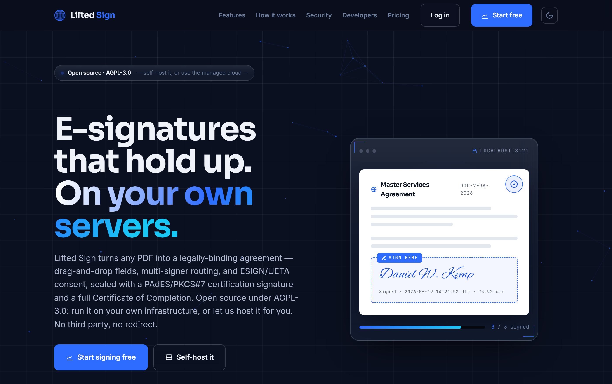
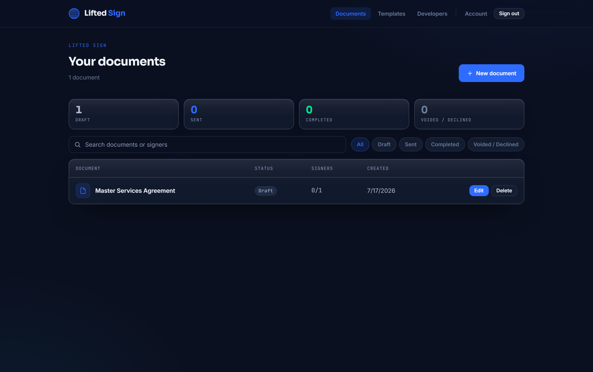

<div align="center">

# Lifted Sign

**The open, self-hostable e-signature server — ESIGN/UETA compliant, a DocuSign alternative.**

[](./LICENSE)
[](./CHANGELOG.md)
[](./CONTRIBUTING.md)
[](https://www.python.org/)
[](#tests)

<br />



</div>

Lifted Sign is a complete e-signature service you run yourself: upload a PDF, add
signers, place fields by anchor, and send single-use signing links. Every completed
document is sealed and ships with a Certificate of Completion — the audit trail of
signer identities, timestamps, IP addresses, and consent records that ESIGN and UETA
call for.

<div align="center">

</div>

## Why Lifted Sign

- **Self-host in one command** — `docker compose up`, or `pip install -e . && python -m sign`.
- **SQLite by default** — zero-config storage out of the box; switch to Postgres by setting one env var.
- **Real PAdES sealing** — completed PDFs get PKCS#7/PAdES certification signatures (falls back to a tamper-evident AES-integrity seal when you have no cert yet).
- **Developer API + SDKs** — a REST API with vendored Python and Node clients and an OpenAPI spec, so integrations are a copy-paste away.

## Quickstart

```bash
git clone https://github.com/Lifted-Holdings/lifted-sign.git
cd lifted-sign
cp .env.example .env

# Generate a real SIGN_SECRET and put it in .env (the server refuses to boot without one):
python -c "import secrets; print('SIGN_SECRET=' + secrets.token_urlsafe(48))"

# Run it — either with Docker:
docker compose up

# …or straight from Python:
pip install -e .
python -m sign
```

Then open **http://localhost:8080**.

> `SIGN_SECRET` is the one required setting. All login sessions, signer-access cookies,
> and one-time codes are keyed off it, so the server fails closed and loud if it is
> missing, too short, or a placeholder.

## Configuration

Every setting is read from the environment (a `.env` file, real env vars, or your
orchestrator's secret store). Copy [`.env.example`](./.env.example) to `.env` and fill
in what you need — it documents each variable, its default, and when you actually need
it. SQLite, console email, and passwordless email **magic-link** sign-in all work with
nothing but `SIGN_SECRET` set; SMTP, Postgres, Google/phone sign-in, and PAdES
certificates are optional add-ons you switch on as you grow.

## Self-hosting

See [**docs/self-hosting.md**](./docs/self-hosting.md) for the full environment
reference, SMTP setup, switching to Postgres, installing a PAdES signing certificate,
and running Lifted Sign behind nginx with TLS.

For a tour of how Lifted Sign is built — the ESIGN/UETA compliance model, the
three-runtime design, and the security and persistence layers — see
[**docs/ARCHITECTURE.md**](./docs/ARCHITECTURE.md).

For a tour of how Lifted Sign is built — the ESIGN/UETA compliance model, the three-runtime design, and the security and persistence layers — see [**docs/ARCHITECTURE.md**](./docs/ARCHITECTURE.md).

## Developer API

Lifted Sign exposes a REST API under `/api/mysign/*` for creating envelopes, adding
signers, placing fields, sending, reminding, voiding, and downloading sealed PDFs and
certificates. The in-app **`/developers`** page documents the endpoints and serves an
OpenAPI spec.

Ready-to-use, dependency-free clients are vendored under [`sdks/`](./sdks):

- [`sdks/lifted_sign.py`](./sdks/lifted_sign.py) — Python 3.8+, standard library only.
- [`sdks/lifted-sign.mjs`](./sdks/lifted-sign.mjs) — Node 18+, built-in `fetch`/`FormData`.

Point either client's `base_url` / `baseUrl` at your own install to drive your
self-hosted server. The SDKs are **MIT-licensed** (see below) so integrating against
Lifted Sign never touches your application's licensing.

## Tiers

| | Self-host | Hosted |
|---|---|---|
| **Price** | Free (AGPL-3.0) | $29.99/mo |
| **Where** | Your infrastructure | [sign.liftedholdings.com](https://sign.liftedholdings.com) |
| **You run** | The server, DB, email, TLS | Nothing — fully managed |
| **Best for** | Full control, data residency, air-gapped | No infra to run, instant setup |

Self-hosting is free forever under the AGPL — run any volume you like on your own
hardware, no strings. The hosted tier is the same software, managed for you — updates,
backups, email delivery, and TLS handled, with no infra to operate.

> **Hosted fair use.** The $29.99/mo hosted plan is sized for a typical small business.
> We reserve the right to suspend, rate-limit, or require a higher plan for any hosted
> account whose volume appears abusive or materially exceeds ordinary small-business use.
> This applies **only** to the managed service — if you self-host, there are no such
> limits. See [`docs/hosted-terms.md`](./docs/hosted-terms.md).

## License

Lifted Sign is licensed under the **GNU Affero General Public License v3.0** — see
[`LICENSE`](./LICENSE).

The client SDKs under [`sdks/`](./sdks/) are licensed under the **MIT License** (see
[`sdks/LICENSE`](./sdks/LICENSE)) so you can vendor them into any project, open or
closed, without the AGPL's network-copyleft obligations reaching your code.

---

Built by Daniel Wilson Kemp · [liftedholdings.com](https://liftedholdings.com)
